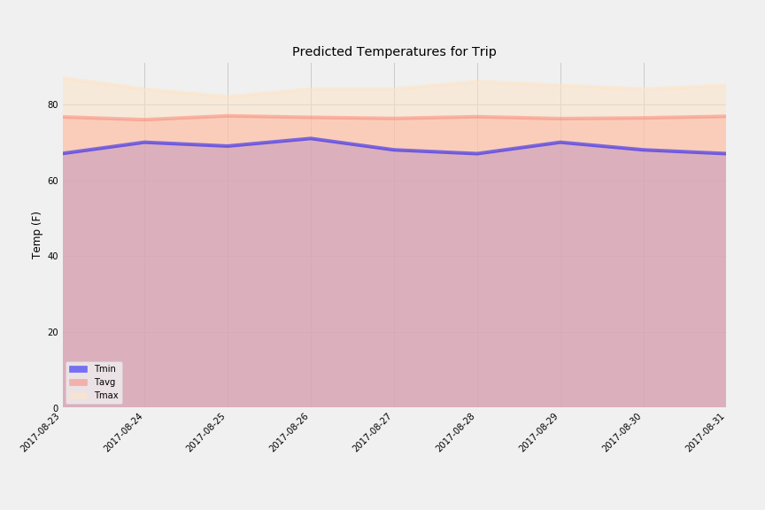

## Climate Analysis and Exploration for Hawaii trip
Use Python, Matplotlib and Pandas and SQLAlchemy to do basic climate analysis and  
data exploration of the climate database.

### Precipitation

### Temp vs Frequency

### Trip Average Temperature

### Predicted Temperatures

